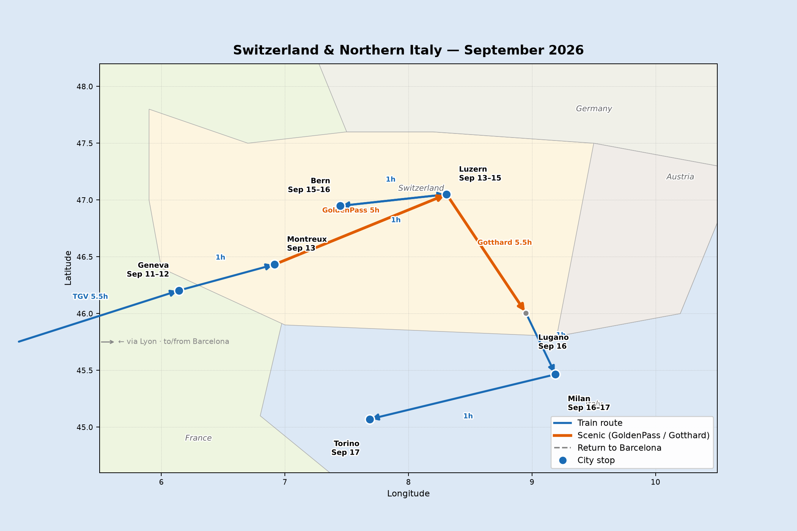
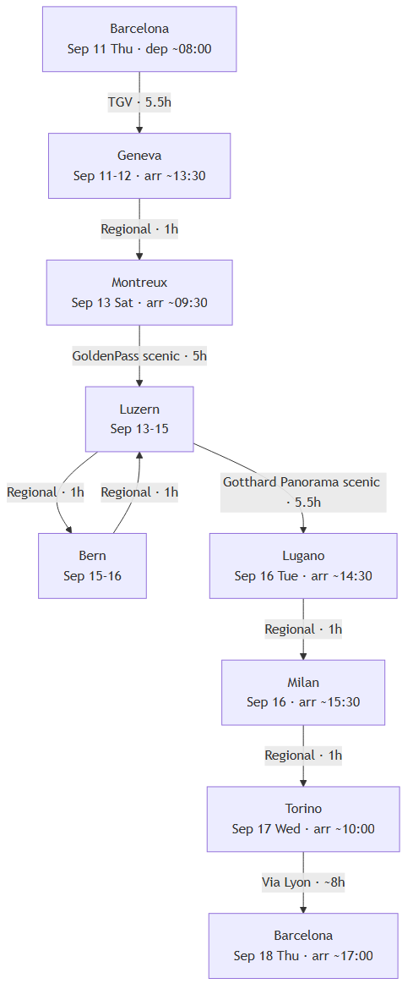

# Switzerland Train Trip — September 2026

**Route:** Barcelona → Geneva → Montreux → Luzern → Bern → Lugano → Milan → Torino → Barcelona
**Duration:** 7 nights / 8 days (Sep 11–18, 2026)

## Itinerary

| Day | Date | Weekday | From → To | Transport | Highlights |
|-----|------|---------|-----------|-----------|------------|
| 1 | Sep 11 | Thursday | Barcelona → Geneva | TGV/AVE via Lyon (~5.5h) | Arrive, Jet d'Eau, Old Town |
| 2 | Sep 12 | Friday | Geneva | — | CERN (book ahead), Old Town |
| 3 | Sep 13 | Saturday | Geneva → Montreux → Luzern | Regional (1h) + GoldenPass (~5h) | Château de Chillon stop, Alpine meadows |
| 4 | Sep 14 | Sunday | Luzern | — | Chapel Bridge, Lake, Mt. Pilatus |
| 5 | Sep 15 | Monday | Luzern → Bern | Regional (~1h) | Zytglogge, Bear Park, Federal Palace |
| 6 | Sep 16 | Tuesday | Bern → Luzern → Lugano → Milan | Regional (1h) + Gotthard Panorama (~5.5h) + Regional (1h) | Lake Luzern boat + Gotthard pass |
| 7 | Sep 17 | Wednesday | Milan → Torino | Regional (~1h) | Egyptian Museum, Mole Antonelliana |
| 8 | Sep 18 | Thursday | Torino → Barcelona | Via Lyon (~8h) or coastal via Nice (~10h) | — |

## Route Map

{width=100%}

{height=22cm}

## Travel Times

> All times approximate — verify at sbb.ch / renfe.com / raileurope.com

| Leg | Date | Dep | Arr | Duration | Train |
|-----|------|-----|-----|----------|-------|
| Barcelona → Geneva | Sep 11 Thu | ≈08:00 | ≈13:30 | 5.5h | TGV/AVE via Lyon |
| Geneva → Montreux | Sep 13 Sat | ≈08:30 | ≈09:30 | 1h | Regional |
| Montreux → Luzern | Sep 13 Sat | ≈11:00 | ≈16:00 | 5h | GoldenPass [scenic] |
| Luzern → Bern | Sep 15 Mon | ≈09:00 | ≈10:00 | 1h | Regional |
| Bern → Luzern | Sep 16 Tue | ≈07:30 | ≈08:30 | 1h | Regional |
| Luzern → Lugano | Sep 16 Tue | ≈09:12 | ≈14:30 | 5.5h | Gotthard Panorama [scenic] |
| Lugano → Milan | Sep 16 Tue | ≈15:00 | ≈16:00 | 1h | Regional |
| Milan → Torino | Sep 17 Wed | ≈08:30 | ≈09:30 | 1h | Regional |
| Torino → Barcelona | Sep 18 Thu | ≈07:00 | ≈15:00–17:00 | 8–10h | Via Lyon or coastal |

## Scenic Trains

| Train | Leg | Duration | Notes |
|-------|-----|----------|-------|
| GoldenPass Panoramic | Montreux → Luzern | ~5h | Via Zweisimmen, Interlaken |
| Gotthard Panorama Express | Luzern → Lugano | ~5.5h | Boat on Lake Luzern + mountain train |

## Book in Advance

- **CERN tours** — home.cern/visits (fills up weeks ahead)
- **GoldenPass panoramic seats** — ~CHF 12 reservation fee
- **Gotthard Panorama Express seats** — popular in September
- **Barcelona → Geneva TGV** — cheaper when booked early

## Return Options (Day 8)

- **Via Lyon** (faster, ~8h): Torino → Chambéry → Lyon → Barcelona
- **Via coast** (scenic, ~10–11h): Torino → Genova → Nice → Marseille → Barcelona

## Pass Options

- **Swiss Travel Pass (6 consecutive days)** covers Sep 13–18 Swiss legs including scenic trains (minus small seat reservations)
- **Eurail Global Pass** for the full trip including Barcelona–Geneva and Torino–Barcelona legs
